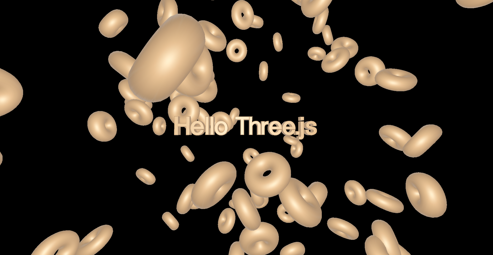

# Three.js 3D Text & Donut Scene

A simple Three.js project rendering 3D text with matcap material and multiple animated torus (donuts).

## 📸 Preview

## Features
- 3D Text using TextGeometry
- Matcap material for realistic shading
- 100 randomly positioned torus objects
- OrbitControls for interaction
- Responsive canvas + fullscreen support

## Tech Stack
- Three.js
- JavaScript
- WebGL

- ## ⚙️ Run Locally

Run using a local server 
- VS Code Live Server 

